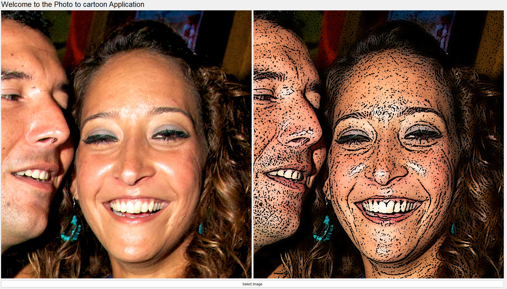
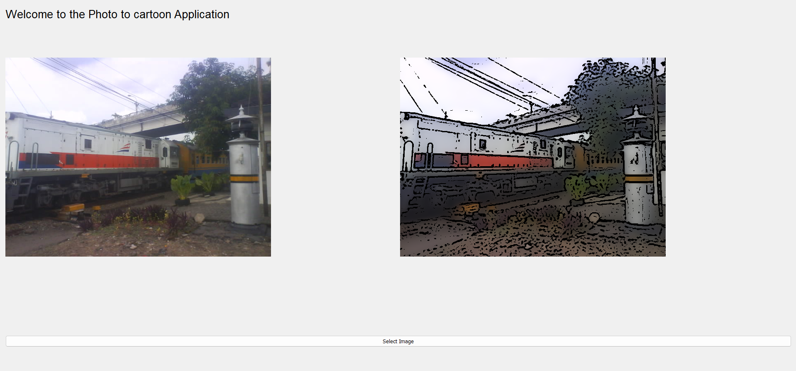
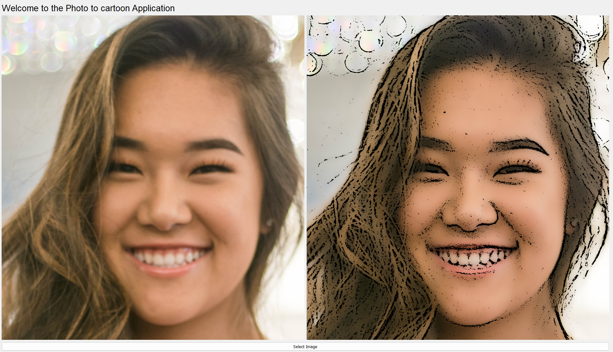

# Photo-To-Cartoon

This is a simple cartoonify project which takes in a picture as input and convrts it into its cartoon style. The project makes use of openCV operation, Machine Learning, and QT

# Overview

# Architecture

# canny vs adaptive thresholding

# Examples

# Conclusion
